# HPC Provenance — Architecture Document

## 1. Overview

This system generates **SLSA-style provenance attestations** for jobs run on
HPC clusters. It is modeled after the [SLSA](https://slsa.dev) provenance
framework and the [in-toto](https://in-toto.io) attestation format, with
[DSSE](https://github.com/secure-systems-lab/dsse) used for signing.

**Phase 1 target environment:** Slurm-managed HPC clusters.

**End-to-end story (future, once implemented):**

1. A job runs on Slurm (e.g. a training run, a simulation, a build step).
2. After the job finishes, the system collects metadata about the **source**
   (git), the **execution environment** (Slurm job parameters/resources), and
   the **artifacts** (input/output file digests).
3. That metadata is assembled into a **SLSA Provenance v1 predicate**.
4. The predicate is wrapped in an **in-toto Statement** describing the output
   artifacts as its `subject`.
5. The statement is wrapped in a **DSSE envelope** and signed.
6. The signed envelope is persisted (provenance repository) and can later be
   **verified** against a policy (trusted keys, expected builder, expected
   source repo, etc.).

This document defines the architecture, module responsibilities, interfaces,
and folder structure needed to support that story — **without implementing
it yet**.

---

## 2. Architectural Style

The system follows **Clean Architecture** (a.k.a. Ports & Adapters /
Hexagonal Architecture), with a strict **Dependency Rule**: source code
dependencies point only **inward**. Outer layers depend on inner layers;
inner layers know nothing about outer layers.

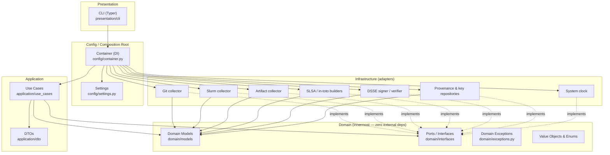

Key principles:

- **Domain layer has zero third-party dependencies** — pure `dataclasses`,
  `enum`, `typing`. This is the "stable core" and is fully unit-testable
  without mocks.
- **Application layer** (use cases) depends only on **domain ports**
  (`Protocol`s), never on concrete infrastructure. This is what makes use
  cases unit-testable with fakes.
- **Infrastructure adapters implement domain ports** — the arrow points
  *inward* (Dependency Inversion Principle): infrastructure depends on
  domain, not the other way around.
- **Composition root** (`config/container.py`) is the *only* place that knows
  about every concrete class. It wires adapters into use cases based on
  `Settings`.
- **Presentation** (CLI) depends only on the composition root and DTOs — it
  contains no business logic.

---

## 3. Layer Responsibilities

| Layer | Package | Responsibility | Depends on |
|---|---|---|---|
| Domain | `domain/` | Entities, value objects, enums, domain exceptions, and **ports** (interfaces) that the rest of the system implements/consumes. No I/O, no frameworks. | nothing (stdlib only) |
| Application | `application/` | Use cases that orchestrate ports to satisfy a business goal (generate / sign / verify provenance). Request/response DTOs. | `domain` |
| Infrastructure | `infrastructure/` | Concrete adapters: Git metadata collection (GitPython), Slurm metadata collection (`sacct`/`scontrol`/env vars), artifact hashing, SLSA predicate + in-toto statement construction, DSSE signing/verification (`cryptography`), provenance/key storage. | `domain`, `application` (DTOs only), external libs |
| Presentation | `presentation/` | CLI entry point (Typer). Parses args, builds request DTOs, invokes use cases via the container, renders output. | `application`, `config` |
| Config | `config/` | `Settings` (environment-driven configuration) and `Container` (composition root / DI wiring). | everything (by necessity) |
| Shared | `shared/` | Cross-cutting concerns: logging setup, base application errors. | `domain` |

---

## 4. Folder Structure

```
HPC_AI_BOMs/
├── pyproject.toml
├── README.md
├── ARCHITECTURE.md
├── IMPLEMENTATION_PLAN.md
├── .gitignore
├── examples/
│   └── train.sh                         # sbatch example: prologue -> training -> epilogue -> verify
├── src/
│   └── hpc_provenance/
│       ├── __init__.py
│       │
│       ├── domain/
│       │   ├── __init__.py
│       │   ├── enums.py                 # DigestAlgorithm, JobState, SchedulerType, ArtifactRole, IssueSeverity
│       │   ├── exceptions.py            # DomainError hierarchy
│       │   ├── value_objects.py         # Digest, JobIdentifier, SigningKey, VerificationKey, ResourceURI
│       │   ├── models/
│       │   │   ├── __init__.py
│       │   │   ├── git_metadata.py      # GitCommit, GitRepositoryMetadata
│       │   │   ├── scheduler_metadata.py# ResourceAllocation, JobExecutionWindow, SlurmJobMetadata
│       │   │   ├── artifact.py          # Artifact
│       │   │   ├── provenance.py        # ResourceDescriptor, BuilderIdentity, BuildMetadata,
│       │   │   │                        # BuildDefinition, RunDetails, SLSAProvenancePredicate
│       │   │   │                        # (each with to_dict()/to_json(), ResourceDescriptor.from_dict())
│       │   │   ├── in_toto.py           # InTotoStatement (to_dict/to_json/from_dict/from_json)
│       │   │   ├── dsse.py              # DSSESignature, DSSEEnvelope (to_dict/to_json/from_dict/from_json)
│       │   │   ├── verification.py      # VerificationIssue, VerificationResult, VerificationPolicy
│       │   │   └── provenance_context.py # ProvenanceContext (aggregate input to predicate builder)
│       │   └── interfaces/
│       │       ├── __init__.py
│       │       ├── collectors.py        # GitMetadataCollector, SchedulerMetadataCollector, ArtifactMetadataCollector
│       │       ├── provenance.py        # ProvenancePredicateBuilder, InTotoStatementBuilder
│       │       ├── signing.py           # PayloadSigner, DSSEEnvelopeSigner, DSSEEnvelopeVerifier
│       │       ├── repositories.py      # ProvenanceRepository, KeyRepository (+ query/record DTOs)
│       │       └── clock.py             # Clock
│       │
│       ├── application/
│       │   ├── __init__.py
│       │   ├── dto/
│       │   │   ├── __init__.py
│       │   │   ├── requests.py          # GenerateProvenanceRequest, SignProvenanceRequest, VerifyProvenanceRequest
│       │   │   └── results.py           # SignProvenanceResult, SlurmProvenanceResult
│       │   ├── services/
│       │   │   ├── __init__.py
│       │   │   └── slurm_provenance_service.py # SlurmProvenanceService (prologue/epilogue orchestration)
│       │   └── use_cases/
│       │       ├── __init__.py
│       │       ├── generate_provenance.py
│       │       ├── sign_provenance.py
│       │       └── verify_provenance.py
│       │
│       ├── infrastructure/
│       │   ├── __init__.py
│       │   ├── collectors/
│       │   │   ├── __init__.py
│       │   │   ├── git_collector.py        # GitPythonMetadataCollector
│       │   │   ├── slurm_collector.py      # SlurmEnvMetadataCollector, SlurmCliMetadataCollector
│       │   │   └── artifact_collector.py   # FilesystemArtifactCollector
│       │   ├── provenance/
│       │   │   ├── __init__.py
│       │   │   ├── slsa_predicate_builder.py    # SLSAv1PredicateBuilder
│       │   │   ├── slsa_predicate_mapper.py     # resource_descriptor_from_artifact + helpers
│       │   │   └── in_toto_statement_builder.py # InTotoV1StatementBuilder
│       │   ├── signing/
│       │   │   ├── __init__.py
│       │   │   ├── dsse_envelope_builder.py # DsseEnvelopeBuilder
│       │   │   ├── payload_signers.py       # RSAPayloadSigner, ECDSAPayloadSigner, create_payload_signer
│       │   │   ├── dsse_signer.py            # DsseSigner
│       │   │   └── dsse_verifier.py          # DsseVerifier
│       │   ├── repositories/
│       │   │   ├── __init__.py
│       │   │   ├── filesystem_provenance_repository.py # FilesystemProvenanceRepository
│       │   │   └── local_key_repository.py             # LocalFileKeyRepository
│       │   └── clock.py                     # SystemClock
│       │
│       ├── presentation/
│       │   ├── __init__.py
│       │   └── cli/
│       │       ├── __init__.py
│       │       ├── app.py                   # Typer app registration
│       │       ├── __main__.py
│       │       └── commands/
│       │           ├── __init__.py
│       │           ├── generate.py          # generate run
│       │           ├── sign.py              # sign run
│       │           ├── verify.py            # verify run (catalog, stubbed), verify attestation
│       │           ├── keys.py              # keys generate
│       │           └── slurm.py             # slurm prologue, slurm epilogue
│       │
│       ├── config/
│       │   ├── __init__.py
│       │   ├── settings.py                  # Settings (pydantic-settings)
│       │   └── container.py                 # Container (composition root)
│       │
│       └── shared/
│           ├── __init__.py
│           ├── errors.py                    # ApplicationError, ConfigurationError
│           └── logging.py                   # configure_logging()
│
└── tests/
    ├── __init__.py
    ├── conftest.py
    ├── fakes/                # in-memory test doubles for every port
    │   ├── __init__.py
    │   ├── clock.py
    │   ├── collectors.py
    │   ├── provenance.py
    │   ├── signing.py
    │   └── repositories.py
    └── unit/
        ├── __init__.py
        ├── domain/
        │   ├── __init__.py
        │   ├── test_value_objects.py
        │   ├── test_provenance.py
        │   ├── test_in_toto.py
        │   └── test_dsse.py
        ├── application/
        │   ├── __init__.py
        │   ├── test_generate_provenance_use_case.py
        │   ├── test_sign_provenance_use_case.py
        │   └── test_slurm_provenance_service.py
        ├── presentation/
        │   ├── __init__.py
        │   ├── test_cli_generate.py
        │   ├── test_cli_sign.py
        │   ├── test_cli_keys.py
        │   ├── test_cli_slurm.py
        │   └── test_cli_verify_attestation.py
        └── infrastructure/
            ├── __init__.py
            ├── test_clock.py
            ├── collectors/
            │   ├── __init__.py
            │   ├── test_git_collector.py
            │   ├── test_artifact_collector.py
            │   ├── test_slurm_helpers.py
            │   ├── test_slurm_env_collector.py
            │   └── test_slurm_cli_collector.py
            ├── provenance/
            │   ├── __init__.py
            │   ├── test_slsa_predicate_builder.py
            │   └── test_in_toto_statement_builder.py
            ├── repositories/
            │   ├── __init__.py
            │   ├── test_local_key_repository.py
            │   └── test_filesystem_provenance_repository.py
            └── signing/
                ├── __init__.py
                ├── test_dsse_envelope_builder.py
                ├── test_payload_signers.py
                ├── test_dsse_signer.py
                └── test_dsse_verifier.py
```

> **What's implemented vs. stubbed:**
> - **Implemented**: domain models (incl. `to_dict()`/`to_json()`/`from_dict()`
>   serialization for `provenance.py`, `in_toto.py`, `dsse.py`), value objects,
>   enums, exceptions, `Settings`, `Container` wiring, `tests/fakes`
>   (in-memory test doubles), the metadata collection layer
>   (`SystemClock`, `GitPythonMetadataCollector`, `SlurmEnvMetadataCollector`,
>   `SlurmCliMetadataCollector`, `FilesystemArtifactCollector`), the SLSA/in-toto
>   builders (`SLSAv1PredicateBuilder`, `InTotoV1StatementBuilder`), the DSSE
>   signer/verifier (`DsseSigner`, `DsseVerifier`, `RSAPayloadSigner`/
>   `ECDSAPayloadSigner`), the `LocalFileKeyRepository` and
>   `FilesystemProvenanceRepository`, `GenerateProvenanceUseCase` and
>   `SignProvenanceUseCase`, the `generate run` / `sign run` / `keys generate` /
>   `verify attestation` / `slurm prologue` / `slurm epilogue` CLI commands, and
>   the `SlurmProvenanceService` application service — all with unit tests.
> - **Stubbed (`raise NotImplementedError`)**: `VerifyProvenanceUseCase.execute()`
>   and the catalog/`ProvenanceRecordId`-based `verify run` CLI command. These
>   are out of scope for the Slurm prologue/epilogue flow, which uses the
>   standalone `verify attestation` command instead (reads a `.dsse` file
>   directly, no provenance catalog lookup needed).

---

## 5. Domain Model — Class Diagrams

### 5.1 Source & Execution Metadata

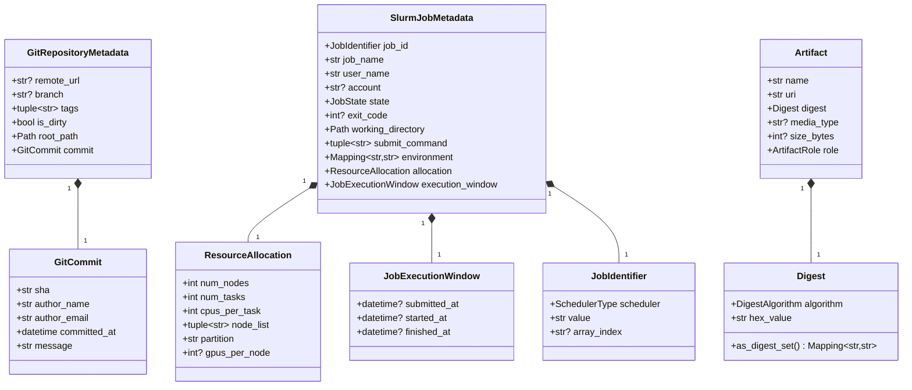

### 5.2 SLSA Provenance & in-toto

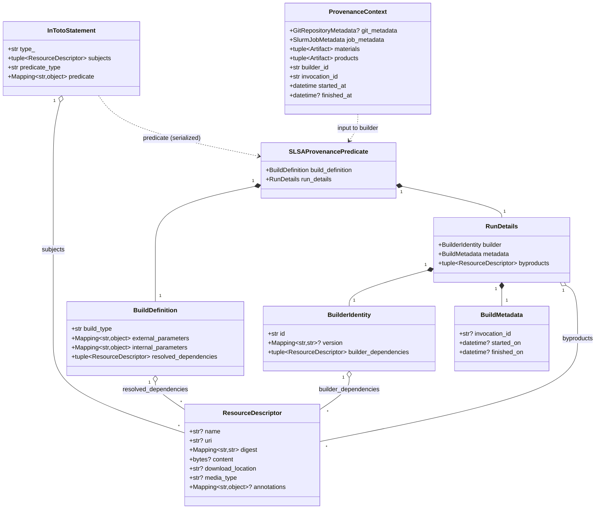

### 5.3 DSSE & Verification

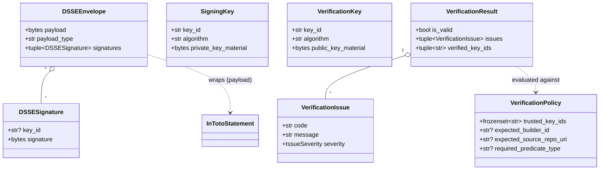

---

## 6. Ports (Interfaces) and Use Cases

All ports live in `domain/interfaces/` as `typing.Protocol` classes
(`@runtime_checkable`), so adapters do **not** need to inherit from them
(structural typing) — though concrete adapters in `infrastructure/` do
inherit explicitly for documentation/IDE support.

| Port | Module | Method(s) | Implemented by |
|---|---|---|---|
| `GitMetadataCollector` | `interfaces/collectors.py` | `collect(repository_path) -> GitRepositoryMetadata` | `GitPythonMetadataCollector` |
| `SchedulerMetadataCollector` | `interfaces/collectors.py` | `collect(job_id=None) -> SlurmJobMetadata` | `SlurmEnvMetadataCollector`, `SlurmCliMetadataCollector` |
| `ArtifactMetadataCollector` | `interfaces/collectors.py` | `collect(paths, role) -> tuple[Artifact, ...]` | `FilesystemArtifactCollector` |
| `ProvenancePredicateBuilder` | `interfaces/provenance.py` | `build(context) -> SLSAProvenancePredicate` | `SLSAv1PredicateBuilder` |
| `InTotoStatementBuilder` | `interfaces/provenance.py` | `build(subjects, predicate_type, predicate) -> InTotoStatement` | `InTotoV1StatementBuilder` |
| `PayloadSigner` | `interfaces/signing.py` | `key_id`, `sign(payload) -> bytes` | `RSAPayloadSigner`, `ECDSAPayloadSigner` |
| `DSSEEnvelopeSigner` | `interfaces/signing.py` | `sign(statement, signers) -> DSSEEnvelope` | `DsseSigner` (uses `DsseEnvelopeBuilder`) |
| `DSSEEnvelopeVerifier` | `interfaces/signing.py` | `verify(envelope, policy, verification_keys) -> VerificationResult` | `DsseVerifier` |
| `ProvenanceRepository` | `interfaces/repositories.py` | `save`, `get`, `list` | `FilesystemProvenanceRepository` |
| `KeyRepository` | `interfaces/repositories.py` | `get_signing_key`, `get_verification_key`, `trusted_key_ids` | `LocalFileKeyRepository` |
| `Clock` | `interfaces/clock.py` | `now() -> datetime` | `SystemClock` |

### Use cases (`application/use_cases/`)

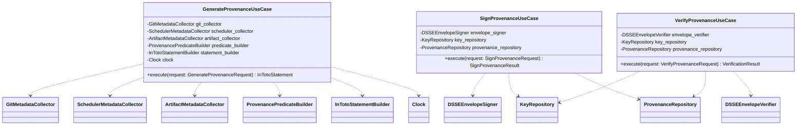

Every dependency above is a **constructor-injected port**. None of these
classes import a concrete infrastructure class — that wiring happens only in
`config/container.py`.

### Application services (`application/services/`)

`SlurmProvenanceService` sits one level above the use cases: it composes
`GenerateProvenanceUseCase` and `SignProvenanceUseCase` (plus a
`SchedulerMetadataCollector` and `GitMetadataCollector` of its own) to
implement the Slurm prologue/epilogue workflow described in §7.4. Like the
use cases, every dependency is constructor-injected; `Container.
slurm_provenance_service()` is the only place that wires it together —
notably, it injects `slurm_env_collector` (`SlurmEnvMetadataCollector`,
env-var based) rather than `scheduler_collector` (`SlurmCliMetadataCollector`,
`sacct`/`scontrol`-based), since prologue/epilogue run *inside* the job where
only environment variables are available.

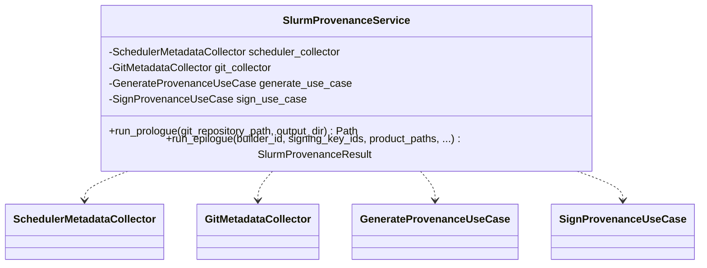

---

## 7. Sequence Diagrams

### 7.1 Generate Provenance

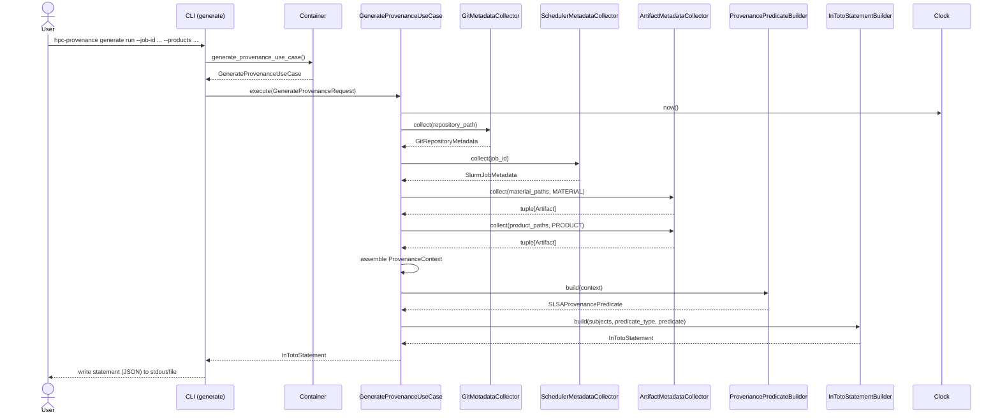

### 7.2 Sign Provenance

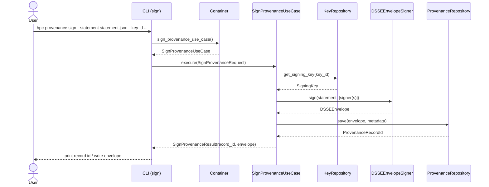

### 7.3 Verify Provenance

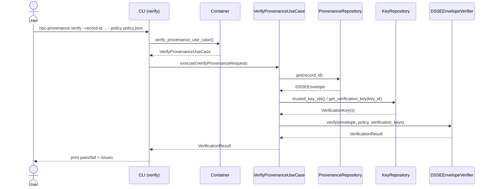

### 7.4 End-to-End (Slurm `sbatch` job: prologue / job / epilogue)

Both `slurm prologue` and `slurm epilogue` run **as the submitting user**,
invoked directly from the user's own `sbatch` script (see
`examples/train.sh`) — no `slurm.conf` changes or scheduler-admin privileges
are required. `Container.slurm_provenance_service()` wires a
`SlurmProvenanceService` whose `scheduler_collector` is the
`SlurmEnvMetadataCollector` (reads `SLURM_JOB_ID`, `SLURM_JOB_USER`,
`SLURM_JOB_NODELIST`, `SLURM_JOB_PARTITION`, `SLURM_SUBMIT_DIR` directly from
the environment — no `sacct`/`scontrol` subprocess calls).

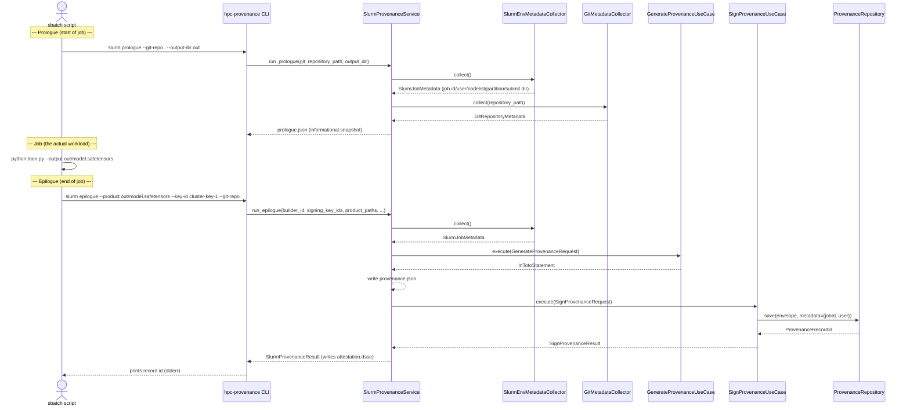

### 7.5 Verify a standalone attestation

`verify attestation` reads a DSSE envelope directly from a file (e.g.
`attestation.dsse` produced by `slurm epilogue`), so it works without the
`ProvenanceRecordId` assigned by `sign run`/`slurm epilogue` and without the
provenance catalog.

```mermaid
sequenceDiagram
    actor User
    participant CLI as CLI (verify attestation)
    participant Keys as KeyRepository
    participant Verifier as DSSEEnvelopeVerifier

    User->>CLI: hpc-provenance verify attestation attestation.dsse --trusted-key-id cluster-key-1
    CLI->>CLI: DSSEEnvelope.from_dict(json.load(path))
    CLI->>Keys: get_verification_key(key_id) for each signature
    Keys-->>CLI: VerificationKey(s)
    CLI->>Verifier: verify(envelope, policy, verification_keys)
    Verifier-->>CLI: VerificationResult
    CLI-->>User: print issues; "VALID"/exit 0 or "INVALID"/exit 1
```

---

## 8. Data Flow Diagram

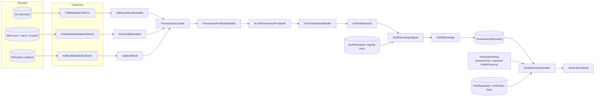

---

## 9. Dependency Injection & Composition Root

- `config/settings.py` defines `Settings` (a `pydantic-settings.BaseSettings`
  subclass) — the **only** place environment variables / config files are
  read.
- `config/container.py` defines `Container`, constructed from a `Settings`
  instance. It exposes **lazily-cached properties** for each adapter
  (`clock`, `git_collector`, `scheduler_collector`, `artifact_collector`,
  `predicate_builder`, `statement_builder`, `envelope_signer`,
  `envelope_verifier`, `provenance_repository`, `key_repository`) and
  **factory methods** for each use case
  (`generate_provenance_use_case()`, `sign_provenance_use_case()`,
  `verify_provenance_use_case()`).
- The CLI (`presentation/cli`) constructs **one** `Container` from `Settings`
  at startup and asks it for use cases. No other module performs
  construction of concrete adapters.
- Adapter selection (e.g. which `SchedulerMetadataCollector` to use) is a
  `Settings`-driven decision inside `Container`, keeping use cases and the
  CLI agnostic of *which* concrete adapter is active.

This gives **constructor injection** throughout (testable in isolation with
fakes) plus a **single composition root** (satisfies "Dependency Injection"
and "Separation of Concerns" requirements without a third-party DI
framework).

---

## 10. Error Handling Strategy

- `domain/exceptions.py` defines a `DomainError` hierarchy
  (`MetadataCollectionError`, `ProvenanceGenerationError`, `SigningError`,
  `VerificationError`, `ProvenanceRecordNotFoundError`). Ports raise these —
  never raw library exceptions — so use cases and tests depend only on domain
  types.
- `shared/errors.py` defines `ApplicationError` / `ConfigurationError` for
  failures that originate outside the domain (e.g. invalid `Settings`).
- Use cases do not catch domain errors — they propagate to the presentation
  layer, which maps them to CLI exit codes / messages. This keeps error
  *policy* (how to present a failure) out of the *domain* and *application*
  layers.

---

## 11. Testing Strategy

- **Domain layer**: pure data + small helpers (`Digest.as_digest_set`,
  `JobIdentifier.__str__`, etc.) — tested directly, no doubles needed.
- **Application layer (use cases)**: each constructor dependency is a
  `Protocol`, so tests inject hand-written **fakes** from `tests/fakes/`
  (`FixedClock`, `FakeGitMetadataCollector`, `InMemoryProvenanceRepository`,
  etc.) — no mocking framework required, full type-checking of fakes against
  the real ports.
- **Infrastructure layer** (once implemented): adapter-level tests against
  real tools where feasible (a throwaway git repo, a local Slurm test
  cluster or recorded `sacct`/`scontrol` output, real `cryptography` keys),
  isolated under `tests/integration/` (not yet created).
- **Presentation layer**: CLI tests via Typer's `CliRunner`, with the
  `Container` swapped for one built from fakes.

---

## 12. Future Extension Strategy

The architecture is designed so each of these is an **additive** change —
new adapter(s) + a `Settings` switch in `Container` — with **no change** to
domain models, ports, or use cases unless the SLSA/in-toto spec itself
changes.

| Extension | How it fits |
|---|---|
| **New schedulers** (PBS, LSF, Cobalt, ...) | Add a new `SchedulerType` enum member + a new `SchedulerMetadataCollector` implementation in `infrastructure/collectors/`. `SlurmJobMetadata` already models scheduler-agnostic concepts (`ResourceAllocation`, `JobExecutionWindow`, `JobIdentifier`); if a scheduler needs fields Slurm doesn't have, extend the model additively (optional fields) rather than branching the port. |
| **New artifact kinds** (container images, model checkpoints, datasets) | Add `ArtifactRole` members and/or new `ArtifactMetadataCollector` implementations (e.g. an OCI-registry collector). `Artifact`/`ResourceDescriptor` already generalize over media type and URI scheme. |
| **New provenance predicate versions** (SLSA v0.2, custom predicates) | Add a new `ProvenancePredicateBuilder` implementation with its own `predicate_type`; select via `Settings`. `InTotoStatementBuilder` is predicate-agnostic (`predicate: Mapping[str, object]`). |
| **New signing backends** (Sigstore keyless, cloud KMS, HSM) | Add new `PayloadSigner` / `DSSEEnvelopeSigner` / `KeyRepository` implementations in `infrastructure/signing/`. Use cases only depend on the ports. |
| **New storage backends** (S3, OCI registry attestations, RDBMS) | Add new `ProvenanceRepository` implementations in `infrastructure/repositories/`. `ProvenanceRecordId` / `ProvenanceQuery` / `ProvenanceRecordSummary` (defined alongside the port) stay storage-agnostic. |
| **Policy-driven verification** (OPA/Rego, custom DSL) | Introduce a `VerificationPolicyEvaluator` port consumed by `VerifyProvenanceUseCase`; `VerificationPolicy` becomes one possible input format among several. |
| **REST API / web UI** | Add `presentation/api/` (FastAPI) alongside `presentation/cli/`. Both call the same `Container`-provided use cases — no duplication of orchestration logic. |
| **Multi-stage / chained builds** (build graphs, SLSA "build chains") | `BuildDefinition.resolved_dependencies` and `ResourceDescriptor` already support referencing prior provenance statements as dependencies; a future `ProvenancePredicateBuilder` can resolve a job's *materials* to *other jobs' products* via `ProvenanceRepository`. |
| **Third-party / plugin adapters** | Adapters are discovered and selected entirely through `Container` + `Settings`. A future iteration can replace the `match`/`if` adapter selection with a registry populated via Python `entry_points`, without touching domain or application code. |
| **Async / large multi-node jobs** | Ports can be re-declared as `async def` (or `AsyncProvenancePort` variants added alongside) without affecting domain models; use cases would gain `async def execute` counterparts. |

---

## 13. Glossary

- **SLSA (Supply-chain Levels for Software Artifacts)**: a framework
  defining provenance metadata about how an artifact was built.
- **in-toto Statement**: a signed, typed envelope format
  (`_type`, `subject`, `predicateType`, `predicate`) used to carry SLSA
  provenance (and other predicate types).
- **DSSE (Dead Simple Signing Envelope)**: a signature envelope format used
  to sign in-toto statements; supports multiple signatures over one payload.
- **Builder**: the trusted entity (here: this system, running on a Slurm
  node) that produced the artifacts and is asserting the provenance.
- **Material**: an input to the build (e.g. source code, datasets).
- **Product / Subject**: an output artifact the statement is *about*.
